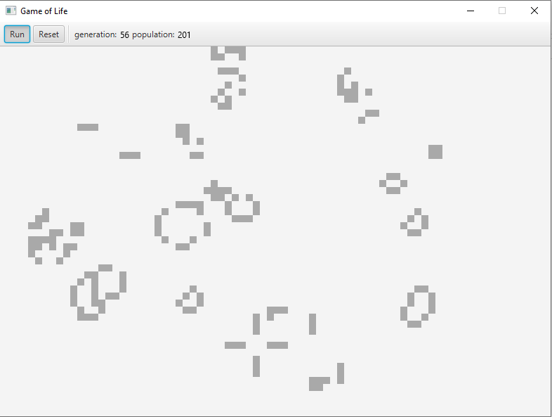

# Game of Life
«Гра́ життя́» — клітинний автомат, винайдений англійським математиком Джоном Конвеєм 1970 року.

Опис гри було опубліковано в жовтневому випуску журналу Scientific American, 
в рубриці «Математичні ігри» Мартіна Гарднера (Martin Gardner).

Для запуску або тестування:
`sbt run` або `sbt test`
